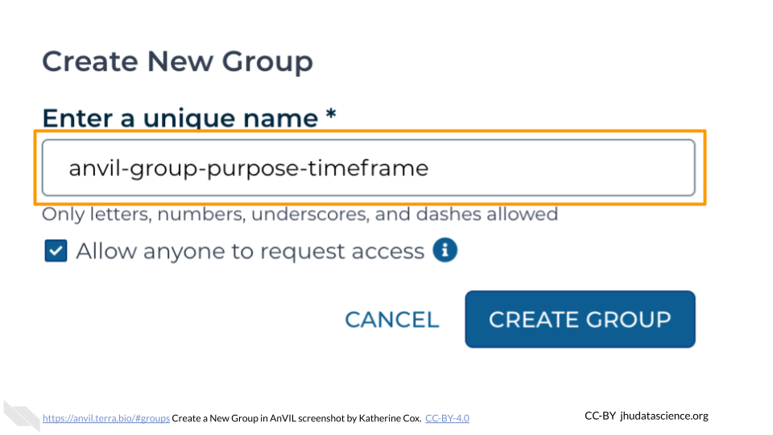
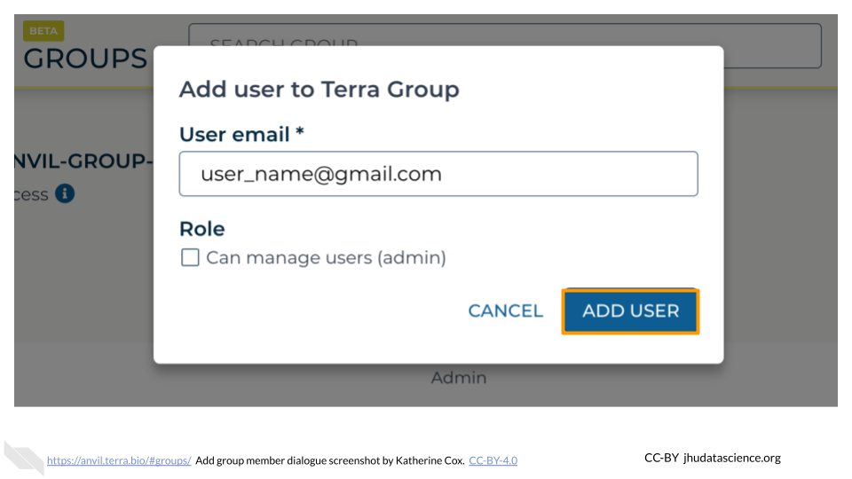

# User Management

Modules about Groups and user management

 

## Create Terra Group

:::: {.borrowed_chunk}

1. [Launch Terra](https://anvil.terra.bio/#workspaces) and sign in with your Google account.

1. In the drop-down menu on the left, navigate to "Groups". Click the triple bar in the top left corner to access the menu. Click the arrow next to your name to expand the menu, then click "Groups".  You can also navigate there directly with this link: https://anvil.terra.bio/#groups

    

1. Click "+ Create a New Group"

    

1. Enter a name for your group.  Names must be unique, so it’s often helpful to include your team’s name, the purpose of the group, and optionally the timeframe, if you will have similar groups in the future.

    

1. Click "CREATE GROUP"

    

1. Your new Group should now show up on the Group Management screen.  Take note of the email address associated with your group.  You will use this email to grant the group access to Billing Projects and Workspaces.

    
::::

## Add Member to Terra Group

:::: {.borrowed_chunk}

1. [Launch Terra](https://anvil.terra.bio/#workspaces) and sign in with your Google account.

1. In the drop-down menu on the left, navigate to "Groups". Click the triple bar in the top left corner to access the menu. Click the arrow next to your name to expand the menu, then click "Groups".  You can also navigate there directly with this link: https://anvil.terra.bio/#groups

    

1. Find the name of the Group you want to add someone to, and confirm that you have Admin privileges for the Group (you can only add and remove members to a Group if you are an Admin).  Click on the name of the Group to view and manage members.

    

1. Click on "+ Add User". You will be prompted to enter the user’s AnVIL ID.

    

1. Type in the user’s email address.  Make sure this is the account that they will be using to access AnVIL.

    

1. If this member will need to add and remove other members of the Group, check the box for "Can manage members (admin)".  This will add them as an "Admin" for the Group.  Otherwise leave it unchecked, and they will be added as a "Member".
     - Admins and Members have equal access to any resources shared with the Group.
     - Admins can manage Group membership - they can add, remove, or change the role of other Group members.

    

1. Click ADD USER. This will take you back to the Group administration page.

    
    
1. The new Group member will now be shown in the list of group members, along with their role.  They should now have access to anything that the Group has been given access to.

    

If you need to remove members or modify their roles, you can do so at any time by clicking the teardrop button next to their name.

::::

## Find Group Email

:::: {.borrowed_chunk}

1. [Launch Terra](https://anvil.terra.bio/#workspaces) and sign in with your Google account.

1. In the drop-down menu on the left, navigate to "Groups". Click the triple bar in the top left corner to access the menu. Click the arrow next to your name to expand the menu, then click "Groups".  You can also navigate there directly with this link: https://anvil.terra.bio/#groups

    

1. Find the name of the Group, then look in the "Group Email" column to find the email address associated with the Group.  Copy this email address and paste it in as the username when adding people to Billing Projects and Workspaces.  This will grant everyone in the Group access to the Billing Project or Workspace.

    
::::
