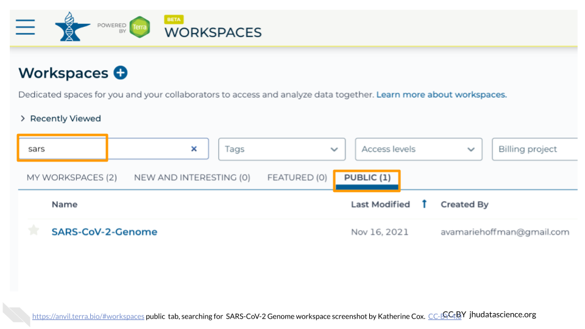
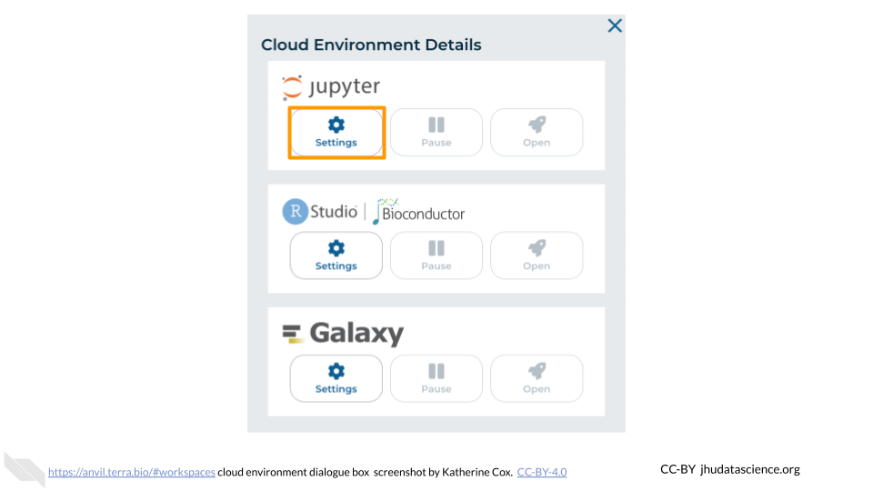
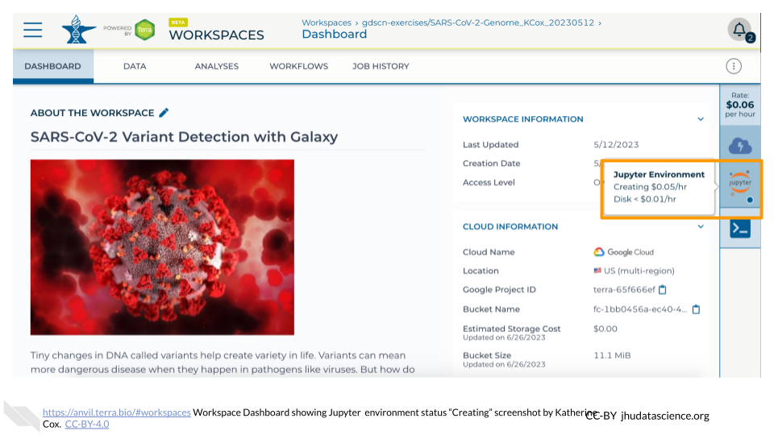
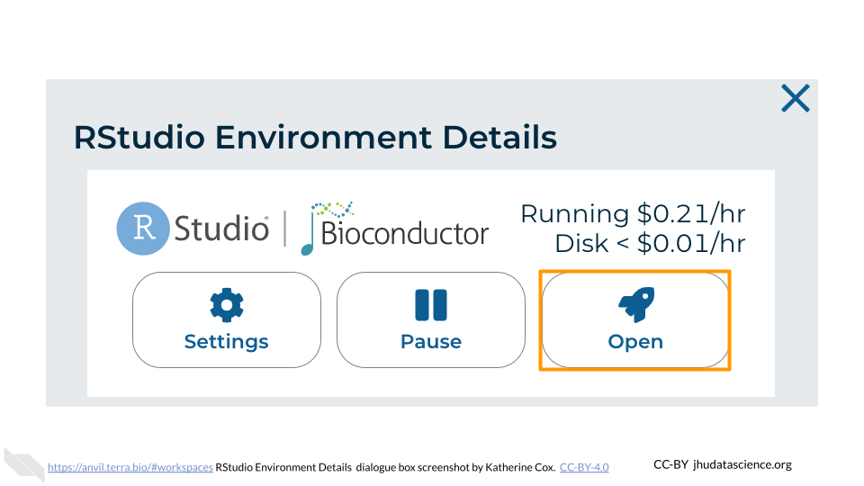
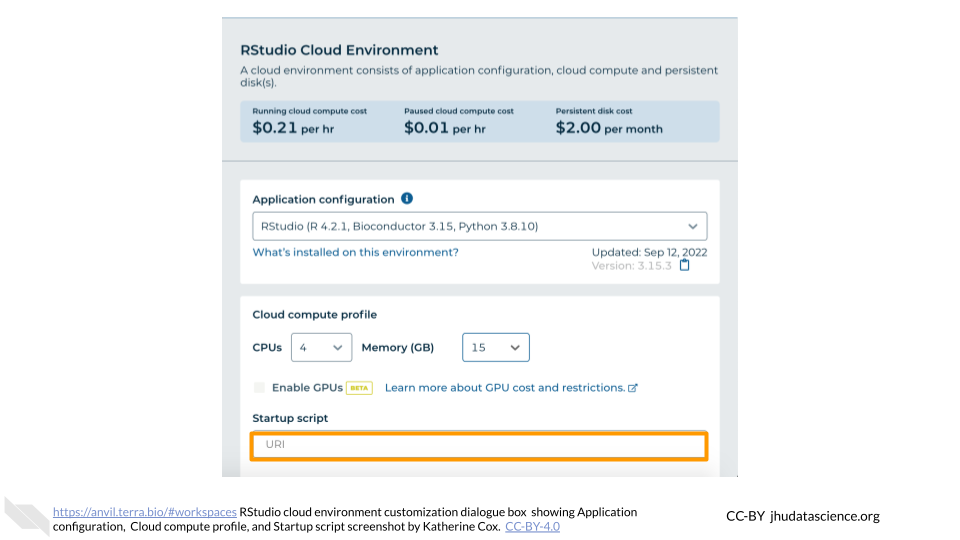

# Student instructions

Modules aimed at students in a course or workshop.
 
 
 
## Student Account Setup
 
:::: {.borrowed_chunk}

In order to run your analyses, you will use the [AnVIL cloud computing platform](https://anvilproject.org/).  The AnVIL (Analysis Visualization and Informatics Lab-space) platform is specially designed for analyzing biological data, and is used by scientists doing all sorts of biological research.

:::{.notice}
**AnVIL in a nutshell**

- Behind the scenes, AnVIL relies on Google Cloud Platform to provide computing infrastructure.  Basically, AnVIL lets you "rent" computers through the internet. The analysis is run on the rented computer. AnVIL lets you see the results in your browser.
- AnVIL uses [Terra](https://anvil.terra.bio/) to provide many computational tools useful for biological data analysis, such as [RStudio](https://www.rstudio.com/products/rstudio/), [Galaxy](https://usegalaxy.org/), and [Jupyter Notebooks](https://jupyter.org/).  Terra takes care of installing these tools so you can use them right away.
:::

### Create Google Account

First, you will need to set up a (free) Google account.

A Google account usually looks like "`myname@gmail.com`". Alternatively, you can enable Google for an existing non-Gmail email address using [these instructions](https://support.terra.bio/hc/en-us/articles/360029186611).

If you do not already have a Google account that you would like to use for accessing AnVIL, [create one now](https://accounts.google.com/SignUp).

### Log In to Terra

Next, make sure you can log in to Terra -- you will use Terra to perform computations on AnVIL. 

You can access Terra by going to [`anvil.terra.bio`](https://anvil.terra.bio/). Open Terra, and you should be prompted to sign in with your Google account.

### Share Username

Make sure your instructor has your Google account username (e.g. `myname@gmail.com`), so they can give you access to everything you need.

- Make sure there are no typos!
- If you have multiple Google accounts, make sure you give them the username that you will be using to log in to `anvil.terra.bio`.

:::{.warning}
It is *very important* that you share the Google account you will be using to access AnVIL with with your instructor! Otherwise, the instructor cannot add you to Billing Projects or Workspaces, and you will be unable to proceed with your assignments.
:::
::::

## Student instructions for cloning a Workspace

These instructions can be customized to a specific workspace by setting certain variables before running `cow::borrow_chapter()`.  If these variables have not been set, reasonable defaults are provided (e.g. "ask your instructor").

### With no variables set:

:::: {.borrowed_chunk}

:::{.warning}
This **will not work** until your instructor has given you permission to spend money to "rent" the computers that will power your analyses (by adding you to a "Billing Project").
:::

On AnVIL, you access files and computers through **Workspaces**.  Each Workspace functions almost like a mini code laboratory - it is a place where data can be examined, stored, and analyzed. The first thing we want to do is to copy or “clone” a Workspace to create a space for you to experiment.  This will give you access to

- the files you will need (data, code)
- the computing environment you will use

:::{.notice}
**Tip**
At this point, it might make things easier to open up a new window in your browser and split your screen. That way, you can follow along with this guide on one side and execute the steps on the other.
:::

To clone an AnVIL Workspace:

1. Open Terra - use a web browser to go to [`anvil.terra.bio`](https://anvil.terra.bio/)

1. In the drop-down menu on the left, navigate to "Workspaces". Click the triple bar in the top left corner to access the menu. Click "Workspaces".

    

1. You are automatically directed to the "MY WORKSPACES" tab.  Here you can see any Workspaces that have been shared with you, along with your permission level.  Depending on how your instructor has set things up, you may or may not see any Workspaces in this tab.

    
    
1. Locate the Workspace **specified by your instructor**.  (The images below show the SARS-CoV-2-Genome Workspace as an example, but you should look for the Workspace  **specified by your instructor**.)
    a. If it has been shared with you ahead of time, it will appear in "MY WORKSPACES".  

    
    b. Otherwise, select the "PUBLIC" tab.  In the top search bar, type the Workspace name **specified by your instructor**.

    
    c. You can also go directly to the Workspace by clicking this link: ask your instructor.
    
1. Clone the workspace by clicking the teardrop button ({width=25px}). Select "Clone".  Or, if you have opened the Workspace, you can find the teardrop button on the top right of the Workspace.

    
    

1. You will see a popup box appear, asking you to configure your Workspace
    a. Give your Workspace clone a name by adding an underscore ("_") and your name. For example, \"ExampleWorkspace_Firstname_Lastname\".
    a. Select the Billing Project provided by your instructor.
    a. Leave the bottom two boxes as-is.
    a. Click “CLONE WORKSPACE”.
    
    

1. The new Workspace should now show up under "MY WORKSPACES".  You now have your own copy of the Workspace to work in.
::::

### With variables set:

:::: {.borrowed_chunk}

:::{.warning}
This **will not work** until your instructor has given you permission to spend money to "rent" the computers that will power your analyses (by adding you to a "Billing Project").
:::

On AnVIL, you access files and computers through **Workspaces**.  Each Workspace functions almost like a mini code laboratory - it is a place where data can be examined, stored, and analyzed. The first thing we want to do is to copy or “clone” a Workspace to create a space for you to experiment.  This will give you access to

- the files you will need (data, code)
- the computing environment you will use

:::{.notice}
**Tip**
At this point, it might make things easier to open up a new window in your browser and split your screen. That way, you can follow along with this guide on one side and execute the steps on the other.
:::

To clone an AnVIL Workspace:

1. Open Terra - use a web browser to go to [`anvil.terra.bio`](https://anvil.terra.bio/)

1. In the drop-down menu on the left, navigate to "Workspaces". Click the triple bar in the top left corner to access the menu. Click "Workspaces".

    

1. You are automatically directed to the "MY WORKSPACES" tab.  Here you can see any Workspaces that have been shared with you, along with your permission level.  Depending on how your instructor has set things up, you may or may not see any Workspaces in this tab.

    
    
1. Locate the Workspace **Example_Workspace**.  (The images below show the SARS-CoV-2-Genome Workspace as an example, but you should look for the Workspace  **Example_Workspace**.)
    a. If it has been shared with you ahead of time, it will appear in "MY WORKSPACES".  

    
    b. Otherwise, select the "PUBLIC" tab.  In the top search bar, type the Workspace name **Example_Workspace**.

    
    c. You can also go directly to the Workspace by clicking this link: http://example.com/.
    
1. Clone the workspace by clicking the teardrop button ({width=25px}). Select "Clone".  Or, if you have opened the Workspace, you can find the teardrop button on the top right of the Workspace.

    
    

1. You will see a popup box appear, asking you to configure your Workspace
    a. Give your Workspace clone a name by adding an underscore ("_") and your name. For example, \"Example_Workspace_Firstname_Lastname\".
    a. Select the Billing Project Example Billing Project.
    a. Leave the bottom two boxes as-is.
    a. Click “CLONE WORKSPACE”.
    
    

1. The new Workspace should now show up under "MY WORKSPACES".  You now have your own copy of the Workspace to work in.
::::

## Student instructions for launching Jupyter

The module below is specially customized for students, allowing you to give more specific instructions on the settings for their Jupyter environment.  There are several other general purpose modules that may also be useful for students (e.g. Pausing Jupyter, Deleting Jupyter) that can be found in other chapters of this book.

The following instructions can be customized by setting certain variables before running `cow::borrow_chapter()`. Developers should create these variables as a list `AnVIL_module_settings`. The following variables can be provided:

- `audience` = Defaults to `general`, telling them to use the default Jupyter settings. If `audience` is set to `student`, it gives more specific instructions.
- `docker_image` = Optional, it will tell them how to set the image.
- `startup_script` =  Optional, it will tell them how to set the script.

### Using default Jupyter environment:

:::: {.borrowed_chunk}

:::{.warning}
AnVIL is very versatile and can scale up to use very powerful cloud computers. It's very important that you select the cloud computing environment described here to avoid runaway costs.
:::

1. Open Terra - use a web browser to go to [`anvil.terra.bio`](https://anvil.terra.bio/)

1. In the drop-down menu on the left, navigate to "Workspaces". Click the triple bar in the top left corner to access the menu. Click "Workspaces".

    

1. Click on the name of your Workspace. You should be routed to a link that looks like: `https://anvil.terra.bio/#workspaces/<billing-project>/<workspace-name>`.

1. Click on the cloud icon on the far right to access your Cloud Environment options.  If you don’t see this icon, you may need to scroll to the right.

    

1. In the dialogue box, click the "Settings" button under Jupyter.

    

1. You will see some configuration options for the Jupyter cloud environment, and a list of costs because it costs a small amount of money to use cloud computing.

    

    

    

    

    

    

    

1. Leave everything else as-is. To create your Jupyter Cloud Environment, scroll down and click the "CREATE" button.

    

1. The dialogue box will close and you will be returned to your Workspace.  You can see the status of your cloud environment by hovering over the Jupyter icon.  It will take a few minutes for Terra to request computers and install software.

    

1. When your environment is ready, its status will change to "Running".  Click on the "ANALYSES" tab to create or open a Jupyter Notebook.

    

1. From the ANALYSES tab, you can click on the name of an existing Jupyter Notebook to view and launch it, or click the "START" button to create a new Notebook.

    

    
::::

### Using custom Jupyter environment:

:::: {.borrowed_chunk}

:::{.warning}
AnVIL is very versatile and can scale up to use very powerful cloud computers. It's very important that you select the cloud computing environment described here to avoid runaway costs.
:::

1. Open Terra - use a web browser to go to [`anvil.terra.bio`](https://anvil.terra.bio/)

1. In the drop-down menu on the left, navigate to "Workspaces". Click the triple bar in the top left corner to access the menu. Click "Workspaces".

    

1. Click on the name of your Workspace. You should be routed to a link that looks like: `https://anvil.terra.bio/#workspaces/<billing-project>/<workspace-name>`.

1. Click on the cloud icon on the far right to access your Cloud Environment options.  If you don’t see this icon, you may need to scroll to the right.

    

1. In the dialogue box, click the "Settings" button under Jupyter.

    

1. You will see some configuration options for the Jupyter cloud environment, and a list of costs because it costs a small amount of money to use cloud computing.

    

    

1. Under "Application configuration" you will see a dropdown menu.  Choose "Custom Environment".  Then copy the following link into "Container image" textbox:

    ` example docker `

    

    

1. Under "Startup script" you will see textbox.  Copy the following link into the box:

    ` example startup script `

    

1. Leave everything else as-is. To create your Jupyter Cloud Environment, scroll down and click the "CREATE" button.

    

1. The dialogue box will close and you will be returned to your Workspace.  You can see the status of your cloud environment by hovering over the Jupyter icon.  It will take a few minutes for Terra to request computers and install software.

    

1. When your environment is ready, its status will change to "Running".  Click on the "ANALYSES" tab to create or open a Jupyter Notebook.

    

1. From the ANALYSES tab, you can click on the name of an existing Jupyter Notebook to view and launch it, or click the "START" button to create a new Notebook.

    

    
::::

## Student instructions for launching RStudio

The module below is specially customized for students, allowing you to give more specific instructions on the settings for their RStudio environment.  There are several other general purpose modules that may also be useful for students (e.g. Pausing RStudio, Deleting RStudio) that can be found in other chapters of this book.

The following instructions can be customized by setting certain variables before running `cow::borrow_chapter()`. Developers should create these variables as a list `AnVIL_module_settings`. The following variables can be provided:

- `audience` = Defaults to `general`, telling them to use the default RStudio settings. If `audience` is set to `student`, it gives more specific instructions.
- `docker_image` = Optional, it will tell them to open the customization dialogue and direct them on how to set the image.
- `startup_script` =  Optional, it will tell them to open the customization dialogue and direct them on how to set the script.

### Using default RStudio environment:

:::: {.borrowed_chunk}

:::{.warning}
AnVIL is very versatile and can scale up to use very powerful cloud computers. It's very important that you select the cloud computing environment described here to avoid runaway costs.
:::

1. Open Terra - use a web browser to go to [`anvil.terra.bio`](https://anvil.terra.bio/)

1. In the drop-down menu on the left, navigate to "Workspaces". Click the triple bar in the top left corner to access the menu. Click "Workspaces".

    

1. Click on the name of your Workspace. You should be routed to a link that looks like: `https://anvil.terra.bio/#workspaces/<billing-project>/<workspace-name>`.

1. Click on the cloud icon on the far right to access your Cloud Environment options.  If you don’t see this icon, you may need to scroll to the right.

    

1. In the dialogue box, click the "Settings" button under RStudio.

    

1. You will see some configuration options for the RStudio cloud environment, and a list of costs because it costs a small amount of money to use cloud computing.

    

    

    

    

    

    

    

1. Leave everything else as-is. To create your RStudio Cloud Environment, scroll down and click the "CREATE" button.

    

1. The dialogue box will close and you will be returned to your Workspace.  You can see the status of your cloud environment by hovering over the RStudio icon.  It will take a few minutes for Terra to request computers and install software.

    

1. When your environment is ready, its status will change to "Running".  Click on the RStudio logo to open a new dialogue box that will let you launch RStudio.

    
    
1. Click the launch icon to open RStudio.  This is also where you can pause, modify, or delete your environment when needed.

    

1. You should now see the RStudio interface with information about the version printed to the console.

    
::::

### Using custom RStudio environment:

:::: {.borrowed_chunk}

:::{.warning}
AnVIL is very versatile and can scale up to use very powerful cloud computers. It's very important that you select the cloud computing environment described here to avoid runaway costs.
:::

1. Open Terra - use a web browser to go to [`anvil.terra.bio`](https://anvil.terra.bio/)

1. In the drop-down menu on the left, navigate to "Workspaces". Click the triple bar in the top left corner to access the menu. Click "Workspaces".

    

1. Click on the name of your Workspace. You should be routed to a link that looks like: `https://anvil.terra.bio/#workspaces/<billing-project>/<workspace-name>`.

1. Click on the cloud icon on the far right to access your Cloud Environment options.  If you don’t see this icon, you may need to scroll to the right.

    

1. In the dialogue box, click the "Settings" button under RStudio.

    

1. You will see some configuration options for the RStudio cloud environment, and a list of costs because it costs a small amount of money to use cloud computing.

    

    

1. Under "Application configuration" you will see a dropdown menu.  Choose "Custom Environment".  Then copy the following link into "Container image" textbox:

    ` example docker `

    

    

1. Under "Startup script" you will see textbox.  Copy the following link into the box:

    ` example startup script `

    

1. Leave everything else as-is. To create your RStudio Cloud Environment, scroll down and click the "CREATE" button.

    

1. The dialogue box will close and you will be returned to your Workspace.  You can see the status of your cloud environment by hovering over the RStudio icon.  It will take a few minutes for Terra to request computers and install software.

    

1. When your environment is ready, its status will change to "Running".  Click on the RStudio logo to open a new dialogue box that will let you launch RStudio.

    
    
1. Click the launch icon to open RStudio.  This is also where you can pause, modify, or delete your environment when needed.

    

1. You should now see the RStudio interface with information about the version printed to the console.

    
::::
